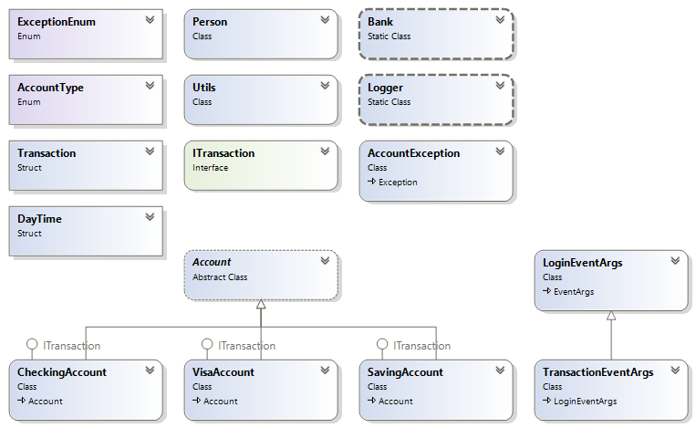

# Assignment 4 – Implementing a Banking Application

### Due: See course shell for due date and time

Check with you professor to see if you are permitted to work as a group.

The application is by far the most complex system that you have
attempted so far. It consists of eleven classes, two structs, one
interface and two enums coupled in varying degrees of tightness. The
Bank class is the main driver of the application. It has a collection of
Accounts and Person that is initialize appropriately in the static
constructor. You will implement the entire system in Visual Studio. A
short description of each type with their members is given below.

You are advised to implement each type in the order that they are
described.

No method should have a **Console.WriteLine()** unless you are
explicitly told to output something on the console.

Each type must be in separate files.

